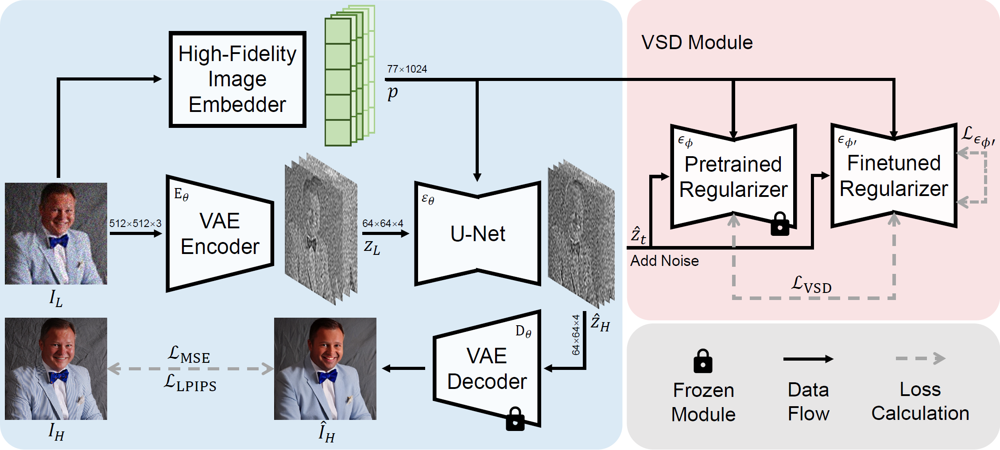
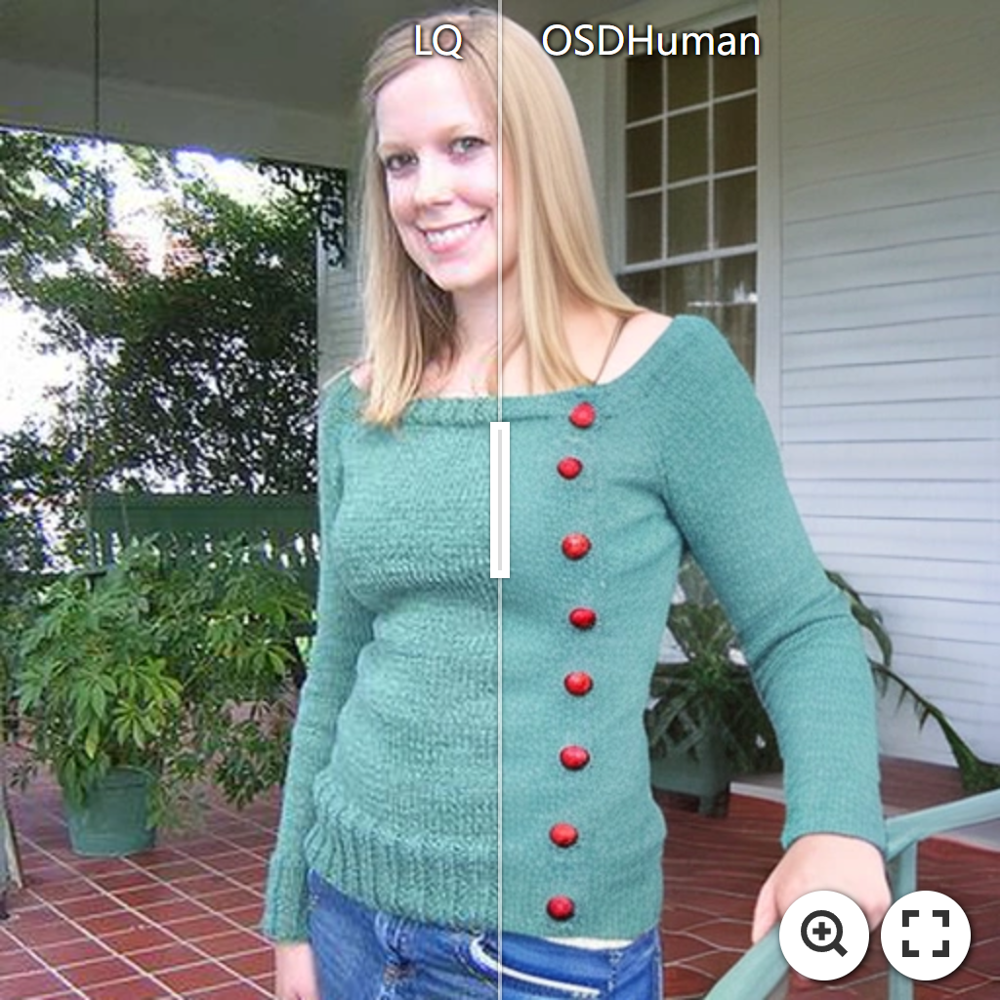
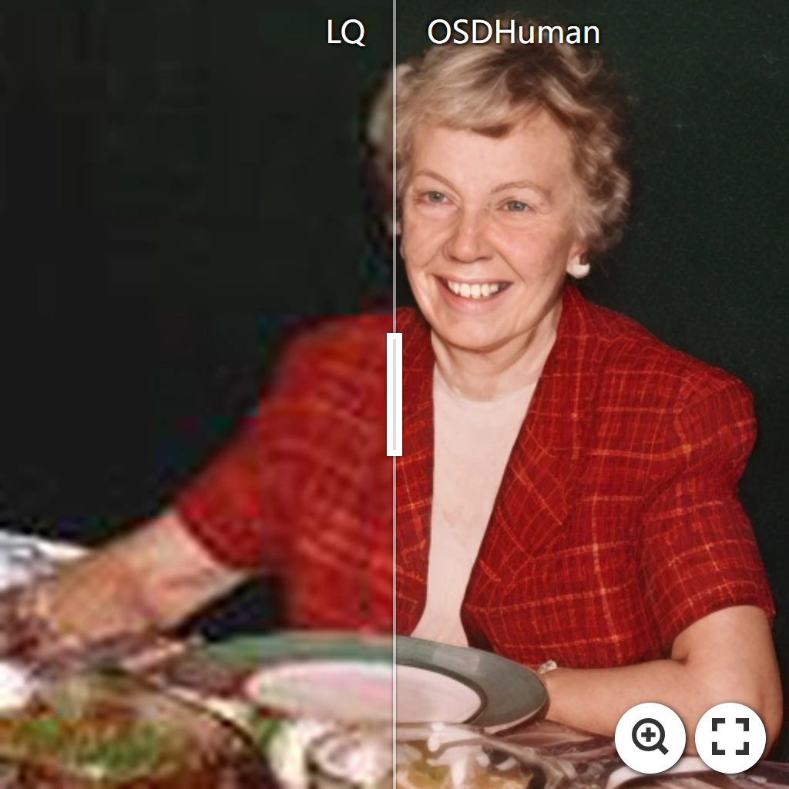
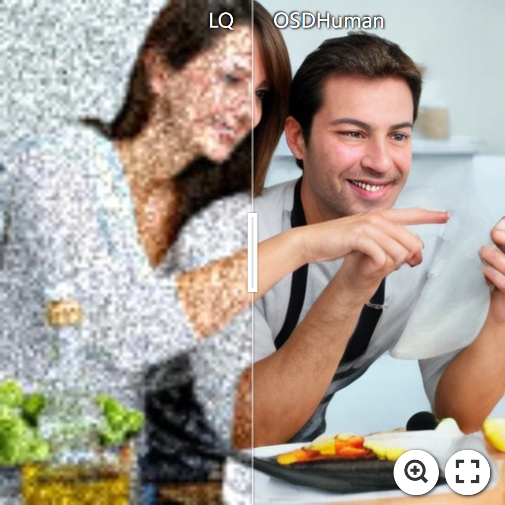
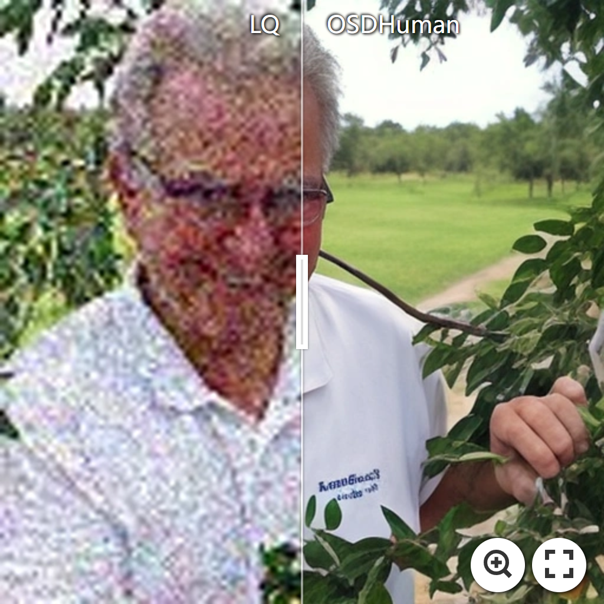
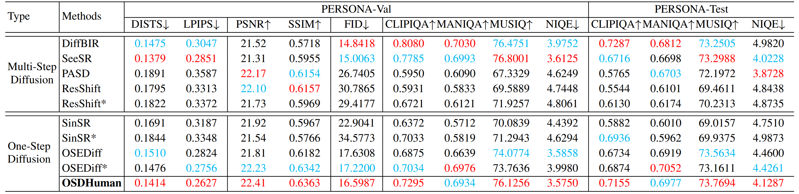

<h1 align="center">
  Human Body Restoration with <br>
  One-Step Diffusion Model and A New Benchmark
</h1>


<p align="center">
🚩 <strong>Accepted by ICML2025</strong>
</p>

<p align="center">
<a href="https://github.com/gobunu">Jue Gong</a>, 
<a href="https://github.com/jkwang28">Jingkai Wang</a>, 
<a href="https://zhengchen1999.github.io/">Zheng Chen</a>, 
Xing Liu, Hong Gu, 
<a href="http://yulunzhang.com/">Yulun Zhang</a>, 
<a href="https://scholar.google.com/citations?user=yDEavdMAAAAJ">Xiaokang Yang</a>
</p>

<p align="center">
"A new benchmark and the first one-step diffusion model for human body restoration.", 2025
</p>

<p align="center">
  <a href="https://arxiv.org/abs/2502.01411">
    
  </a>
  <a href="https://github.com/gobunu/OSDHuman/releases/download/v1/supp.pdf">
    
  </a>
  <a href="https://github.com/gobunu/OSDHuman/releases">
    
  </a>
  <a href="https://github.com/gobunu/OSDHuman">
    
  </a>
  <a href="https://github.com/gobunu/OSDHuman">
    
  </a>
</p>


#### 🔥🔥🔥 News

- **2025-02-05:** This repo is released.
- **2025-05-01**: 🎉 Congratulations! OSDHuman has been accepted to **ICML 2025**.
- **2025-05-04**: 🧪 Released the test and validation sets proposed in the paper.
---

> **Abstract:** Human body restoration, as a specific application of image restoration, is widely applied in practice and plays a vital role across diverse fields. However, thorough research remains difficult, particularly due to the lack of benchmark datasets. In this study, we propose a high-quality dataset automated cropping and filtering (HQ-ACF) pipeline. This pipeline leverages existing object detection datasets and other unlabeled images to automatically crop and filter high-quality human images. Using this pipeline, we constructed a person-based restoration with sophisticated objects and natural activities (PERSONA) dataset, which includes training, validation, and test sets. The dataset significantly surpasses other human-related datasets in both quality and content richness. Finally, we propose OSDHuman, a novel one-step diffusion model for human body restoration. Specifically, we propose a high-fidelity image embedder (HFIE) as the prompt generator to better guide the model with low-quality human image information, effectively avoiding misleading prompts. Experimental results show that OSDHuman outperforms existing methods in both visual quality and quantitative metrics. 



---

[](https://imgsli.com/MzQ1ODk0) [](https://imgsli.com/MzQ1ODky)[](https://imgsli.com/MzQ1ODk3) [](https://imgsli.com/MzQ1ODk4)

---

## ⚒️ TODO

* [ ] Release code and pretrained models
* [ ] Release PERSONA dataset

## 🔗 Contents

- [ ] PERSONA Training Set
- [x] [PERSONA Test and Validation Set](#Test_Validation_Set)
- [ ] Models
- [ ] Testing
- [ ] Training
- [x] [Results](#Results)
- [x] [Citation](#Citation)
- [ ] [Acknowledgements](#Acknowledgements)

## <a name="Test_Validation_Set"></a>🎭 PERSONA Test and Validation Set

We provide three sets for evaluation, including both high- and low-quality validation images, and a real-world test set.

| Dataset           | Description                             | Download Link |
|------------------|-----------------------------------------|---------------|
| PERSONA-Val HQ   | High-quality validation set             | [Google Drive](https://drive.google.com/file/d/1JaUzyDBJHytl3MfFBdcGAaO7uYDfP3vS/view?usp=drive_link) |
| PERSONA-Val LQ   | Low-quality (degraded) validation set   | [Google Drive](https://drive.google.com/file/d/1qzJETavxMFxUDyimYxg4Ob5GmAAHmuMG/view?usp=drive_link) |
| PERSONA-Test     | Real-world test set                     | [Google Drive](https://drive.google.com/file/d/1n_rywHB2apB9kWgZSRdnzMxQsJKWIEMR/view?usp=drive_link) |

## <a name="results"></a>🔎 Results

The model **OSDHuman** achieved state-of-the-art performance on both the datasets **PERSONA-Val** and **PERSONA-Test**. Detailed results can be found in the paper.

<details>
<summary>&ensp;Quantitative Comparisons (click to expand) </summary>
<li> Results in Table 2 on synthetic PERSONA-Val and real-world PERSONA-Test datasets from the main paper. 
<p align="center">

</p>
</li>
</details>
<details open>
<summary>&ensp;Visual Comparisons (click to expand) </summary>
<li> Results in Figure 8 on real-world PERSONA-Test dataset from the main paper.
<p align="center">

</p>
</li>
<li> Results in Figure 9 on synthetic PERSONA-Val dataset from the main paper.
<p align="center">

</p>
</li>
</details>
<details>
<summary style="margin-left: 2rem;">&ensp;More Comparisons on real-world PERSONA-Test dataset... </summary>
<li style="margin-left: 2rem;"> Results in Figure 3, 4 from supplemental material.
<p align="center">

</p>
<p align="center">

</p>
</li>
</details>
<details>
<summary style="margin-left: 2rem;">&ensp;More Comparisons on synthetic PERSONA-Val dataset... </summary>
<li style="margin-left: 2rem;"> Results in Figure 5, 6 from supplemental material.
<p align="center">

</p>
<p align="center">

</p>
</li>
</details>


## <a name="citation"></a>📎 Citation

If you find the code helpful in your research or work, please cite the following paper(s).

```
@inproceedings{gong2025osdhuman,
    title={Human Body Restoration with One-Step Diffusion Model and A New Benchmark},
    author={Jue Gong and Jingkai Wang and Zheng Chen and Xing Liu and Hong Gu and Yulun Zhang and Xiaokang Yang},
    booktitle={ICML},
    year={2025}
}
```

## <a name="acknowledgements"></a>💡 Acknowledgements

[TBD]

<!--  -->
