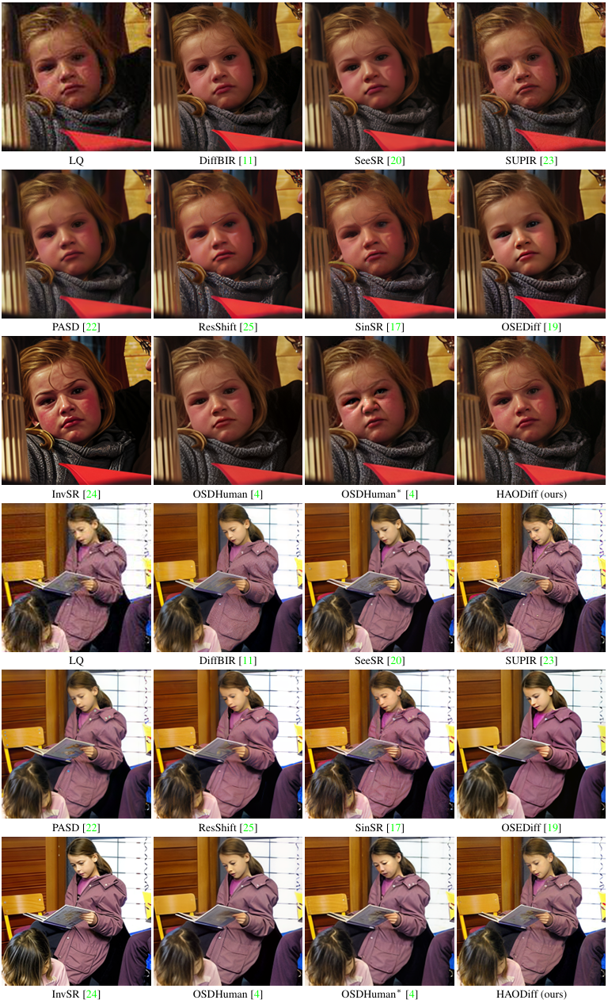

<h1 align="center">
  HAODiff: Human-Aware One-Step Diffusion <br>
  via Dual-Prompt Guidance 
</h1>


<p align="center">
<a href="https://github.com/gobunu">Jue Gong</a>, 
<a href="https://github.com/frakenation">Tingyu Yang</a>, 
<a href="https://github.com/jkwang28">Jingkai Wang</a>, 
<a href="https://zhengchen1999.github.io/">Zheng Chen</a>, 
Xing Liu, Hong Gu, 
<a href="http://yulunzhang.com/">Yulun Zhang</a>, 
<a href="https://scholar.google.com/citations?user=yDEavdMAAAAJ">Xiaokang Yang</a>
</p>

<p align="center">
"A novel one-step diffusion model for human body restoration, efficiently handling human motion blur and generic noise in human images.", 2025
</p>

<p align="center">
  <a href="https://arxiv.org/abs/2505.19742">
    
  </a>
  <a href="https://github.com/gobunu/HAODiff/releases/download/Paper/supp.pdf">
    
  </a>
  <a href="https://github.com/gobunu/HAODiff/releases">
    
  </a>
  <a href="https://github.com/gobunu/HAODiff">
    
  </a>
  <a href="https://github.com/gobunu/HAODiff">
    
  </a>
</p>


#### 🔥🔥🔥 News

- **2025-05-27:** This repo is released.
---

> **Abstract:** Human-centered images often suffer from severe generic degradation during transmission and are prone to human motion blur (HMB), making restoration challenging. Existing research lacks sufficient focus on these issues, as both problems often coexist in practice. To address this, we design a degradation pipeline that simulates the coexistence of HMB and generic noise, generating synthetic degraded data to train our proposed HAODiff, a human-aware one-step diffusion. Specifically, we propose a triple-branch dual-prompt guidance (DPG), which leverages high-quality images, residual noise (LQ minus HQ), and HMB segmentation masks as training targets. It produces a positive-negative prompt pair for classifier-free guidance (CFG) in a single diffusion step. The resulting adaptive dual prompts let HAODiff exploit CFG more effectively, boosting robustness against diverse degradations. For fair evaluation, we introduce MPII-Test, a benchmark rich in combined noise and HMB cases. Extensive experiments show that our HAODiff surpasses existing state-of-the-art (SOTA) methods in terms of both quantitative metrics and visual quality on synthetic and real-world datasets, including our introduced MPII-Test.

<p align="center">
  <br>
  <b>Figure 2:</b> Degradation pipeline overview.
</p>

<p align="center">
  <br>
  <b>Figure 3:</b> Model structure of our HAODiff.
</p>

---
<div align="center">

<table>
  <tr>
    <td align="center">
      <a href="https://imgsli.com/MzgzMjE2"></a><br>
      <a href="https://imgsli.com/MzgzMjE3"></a><br>
      <b>PERSONA-Val</b>
    </td>
    <td align="center">
      <a href="https://imgsli.com/MzgzMjEw"></a><br>
      <a href="https://imgsli.com/MzgzMjEx"></a><br>
      <b>MPII-Test</b>
    </td>
    <td align="center">
      <a href="https://imgsli.com/MzgzMjE0"></a><br>
      <a href="https://imgsli.com/MzgzMjE1"></a><br>
      <b>PERSONA-Test</b>
    </td>
  </tr>
</table>

</div>


---

## ⚒️ TODO

* [ ] Release code and pretrained models

## 🔗 Contents

- [ ] Models
- [ ] Testing
- [ ] Training
- [x] [Results](#Results)
- [x] [Citation](#Citation)
- [ ] [Acknowledgements](#Acknowledgements)

## <a name="results"></a>🔎 Results

The model **HAODiff** achieved state-of-the-art performance on both the datasets **PERSONA-Val**, **PERSONA-Test**, and **MPII-Test**. Detailed results can be found in the paper.

<details>
<summary>&ensp;Quantitative Comparisons (click to expand) </summary>
<li> Results in Table 1 on synthetic PERSONA-Val dataset from the main paper. 
<p align="center">

</p>
</li>
<summary>&ensp;Quantitative Comparisons (click to expand) </summary>
<li> Results in Table 2 on real-world PERSONA-Test and MPII-Test datasets from the main paper. 
<p align="center">

</p>
</li>
</details>
<details>
<summary>&ensp;Visual Comparisons (click to expand) </summary>
<li> Results in Figure 5 on synthetic PERSONA-Val dataset from the main paper.
<p align="center">

</p>
</li>
<li> Results in Figure 6 on real-world PERSONA-Test and MPII-Test datasets from the main paper.
<p align="center">

</p>
</li>
</details>
<details open>
<summary style="margin-left: 2rem;">&ensp;More Comparisons on fabric patterns and textures... </summary>
<li style="margin-left: 2rem;"> Results in Figure 4 from supplemental material.
<p align="center">

</p>
</li>
</details>
<details>
<summary style="margin-left: 2rem;">&ensp;More Comparisons on synthetic PERSONA-Val dataset... </summary>
<li style="margin-left: 2rem;"> Results in Figure 5, 6 from supplemental material.
<p align="center">

</p>
<p align="center">

</p>
</li>
</details>
<details>
<summary style="margin-left: 2rem;">&ensp;More Comparisons on real-world PERSONA-Test dataset... </summary>
<li style="margin-left: 2rem;"> Results in Figure 7, 8 from supplemental material.
<p align="center">

</p>
<p align="center">

</p>
</li>
</details>

<details>
<summary style="margin-left: 2rem;">&ensp;More Comparisons on real-world MPII-Test dataset... </summary>
<li style="margin-left: 2rem;"> Results in Figure 9, 10 from supplemental material.
<p align="center">

</p>
<p align="center">

</p>
</li>
</details>

<details>
<summary style="margin-left: 2rem;">&ensp;More Comparisons on challenge tasks... </summary>
<li style="margin-left: 2rem;"> Results in Figure 11, 12 from supplemental material.
<p align="center">

</p>
<p align="center">

</p>
</li>
</details>


## <a name="citation"></a>📎 Citation

If you find the code helpful in your research or work, please cite the following paper(s).

```
@article{gong2025haodiff,
    title={{HAODiff: Human-Aware One-Step Diffusion via Dual-Prompt Guidance}},
    author={Gong, Jue and Yang, Tingyu and Wang, Jingkai and Chen, Zheng and Liu, Xing and Gu, Hong and Liu, Yutong and Zhang, Yulun and Yang, Xiaokang},
    journal={arXiv preprint 2505.19742},
    year={2025}
}
```

## <a name="acknowledgements"></a>💡 Acknowledgements

[TBD]

<!--  -->
